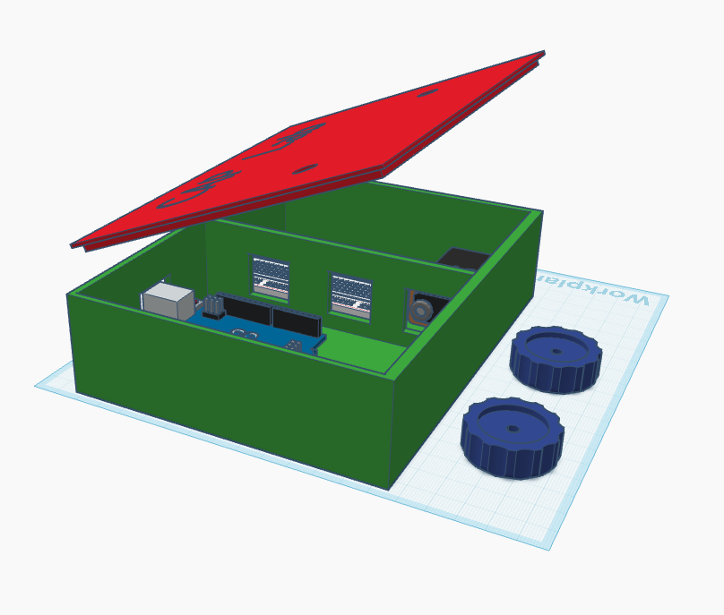

# Build an Etch a Sketch 

## Initial Instructions 
These are loose - we will get better descriptives up here soon. 

### Purchasing
1. Find an Arduino Uno (In the lab or purchase online)
2. Find or Buy two potentiometers. These should be compatible with 5 Volt components and power supply - this is what the Arduino uses (I think... it's been a while)
3. Scavenge assorted connector wires from other CAP lab projects. 

#### Parts List
- [Two (2) Potentiometers ($1.30 each)](https://www.digikey.com/en/products/detail/bourns-inc/PDB181-A420K-503A2/4699093?gclsrc=aw.ds&gad_source=1&gad_campaignid=20243136172&gbraid=0AAAAADrbLlj8RdOPFWroKyWJ3btMDyw_J&gclid=Cj0KCQjw6bfHBhDNARIsAIGsqLhltrHwzyhd7mIw-Kms8OvipQ7GZT-S-K5Y1IyMLdgJk2KTipEgnpoaAhhIEALw_wcB)
- [Arduino Uno board ($26.30)](https://www.digikey.com/en/products/detail/arduino/A000073/3476357?gclsrc=aw.ds&gad_source=1&gad_campaignid=20243136172&gbraid=0AAAAADrbLlj8RdOPFWroKyWJ3btMDyw_J&gclid=Cj0KCQjw6bfHBhDNARIsAIGsqLjkKe_s8SkAUwMkwyJ9BtAG6yQBGvvlMJVp6CxLwOLJ3Yr8T-5hWcAaAp6EEALw_wcB)
- [USB Type-B Cable ($2.66)](https://www.digikey.com/en/products/detail/qualtek/3021001-03/1531288?gclsrc=aw.ds&gad_source=1&gad_campaignid=20232005509&gbraid=0AAAAADrbLljVOIc1rci2_E6cg2Wi8gmRK&gclid=Cj0KCQjw6bfHBhDNARIsAIGsqLhVrAyP2lGW_R2LZNylxyrK7Vw1ALZPhAEOEcOOz_pRU5NU0-QWTfEaAoFsEALw_wcB)
- [Male-to-Male Jumper wires ($2)](https://www.digikey.com/en/products/detail/adafruit-industries-llc/1956/6827089?gclsrc=aw.ds&gad_source=1&gad_campaignid=20232005509&gbraid=0AAAAADrbLljVOIc1rci2_E6cg2Wi8gmRK&gclid=Cj0KCQjw6bfHBhDNARIsAIGsqLi-Nmhftm0o5NrfARGzqDbEMXsBa2eiJJNGcWBwrjjxl-mck8MOa60aAvolEALw_wcB)
- [Breadboard ($3)](https://www.digikey.com/en/products/detail/dfrobot/FIT0096/7597069)

### Printing
1. Find a place to Print the 3dFiles in [/3dFiles]
2. Depending on your printer, it may be better to print the box, box lid separately, and the knobs together. 
3. Resize the objects/files to fit your experiment better. (The current designs in the 3dFiles source are estimates, aside from ORIGINAL - which was for wood cutting and required quite a bit of post-print post construction finagling.)
3. Original is also printable, I would consider reducing the infill and maybe bevelling the edges in CAD.
4. Print again - hip hip!

### Coding
1. Download Arduino and Processing (Code Applications)
2. Use the Files in Arduino and Processing to load the required code onto the devices. 

### Assembly
1. Wire up the Potentiometers, Figure out which pins they go into (This is specified in the Arduiono Code) 
2. If you have a breadboard - you don't actually need to solder to anything except the potentiometers. 

### Experiment!!

